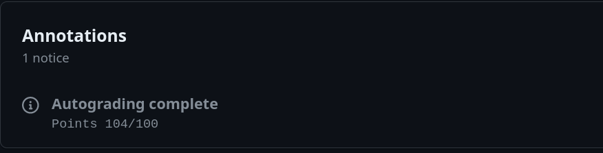
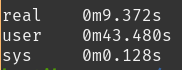
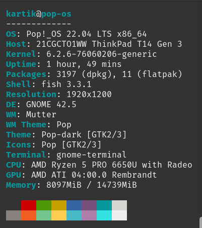

## Introduction

We were provided an assignment as a part of Summer of Bitcoin 2024. The assignment required us to mine a block from given transactions in the `mempool/` folder.

## Design Approach

To tackle this challenge I decided to use `C++` as my programming language and use the concept of OOPS where possible. My solution is therefore divided into several classes which work in unison to complete the objective. The following steps are performed to mine a block successfully in my solution :

1. All transactions are read one by one from the `mempool` folder.
2. Verification is performed on the scripts within each transaction(P2PKH, P2WPKH, P2SH, and P2WSH). All transactions which fail verification are filtered-out.
3. Valid transactions are then sorted according to their `fees/weight` ratio to maximize our award.
4. Bock Header and a coinbase transaction is generated.
5. A block is mined and `output.txt` is generated.

## Implementation Details

### Introductory Info

- Programming Language: C++
- Language Standard: GNU++23
- Buildsystem used: Meson + Ninja
- Libraries used: [Hash](https://github.com/Chocobo1/Hash), [nlohmann_json](https://github.com/nlohmann/json), [libsecp256k1](https://github.com/bitcoin-core/secp256k1)

### Brief overview of the files in source code

My solution is divided into several files:

| Files               | Class / Namespace | Description                                                                                                                                         |
| ------------------- | ----------------- | --------------------------------------------------------------------------------------------------------------------------------------------------- |
| mempool[.cpp/.h]    | Mempool           | This class provides the functionality to read the transactions from disk to memory.                                                                 |
| verifier[.cpp/.h]   | TxVerifier        | This namespace provides the `verify(..)` function which verifies the scrips within a transaction.                                                   |
| serializer[.cpp/.h] | Serializer        | This namespaces provides various functions related to serialization, for eg., functions to serialize a transaction.                                 |
| script[.cpp/.h]     | Script            | The class `Script` within the namespace of the same name is where the functionality for executing a script contained within a transaction is given. |
| crypto[.cpp/.h]     | Crypto            | As the name suggets, functions with this namespace provide various crypto related functionality.                                                    |
| tx[.cpp/.h]         | Tx                | All structs related to transactions such as TxIn and TxOut and related functionality such as calculating fees, etc. is within the Tx namespace.     |
| Block[.cpp/.h]      | Block             | The Block namespace contains the Block struct (BlockHeader) and provides functioanlity to calculate merkleRoot.                                     |
| main.cpp            | -                 | As the name suggests this file conatins the main function.                                                                                          |

### Working

In this section, I'll explain the working of my solution in a slightly more detailed manner.
The following steps are taken to mine a valid block:
#### 1. Read transactions from mempool
Transactions in json format are read from the `mempool` folder, followed by the creation of a struct from data in the json files which is then stored in a vector. For parsing the json files, `nlohmann_json` library is used. Fees, Weight, TxId and WTxId is also generated for the Transaction during this step.
#### 2. Verification of Transactions
The list of transactions from the previous step is then passed to the `TxVerifier::verify(..)` function which splits the list into several smaller batches based on the number of concurrent threads supported by a system. This function makes heavy use of the concept of concurrency and multi-threading to minimize runtime. New threads are launched(same number as the number of concurrent threads supported), and every thread is passed a batch of transactions to verify. If a transaction is valid,  it is added to a common results list(`verifiedTx`) which is shared by all threads.

The script class *only* implements a subset of opcodes. A transaction is treated as invalid incase an unsupported opcode is found.

I have implemented support for `P2PKH`, `P2WPKH`, `P2SH` and `P2WSH` scripts, however support for verifying `P2TR` scripts is still missing.

#### 3. Maximizing rewards
The verified transactions are now sorted to maximize the rewards. Sorting is done on the basis of `fees/weight` ratio. The rationale behind taking the `fees/weight` ratio is to maximize the fees while minimizing the weight. In other words, we want to include transactions which have **more fees** and **less weight** in our block. After sorting the list, we create a list from the top transactions till the total weight does not reach close to ` 4,000,000` vu which is the standard [block limit](https://learnmeabitcoin.com/technical/transaction/size/#weight).

One thing to note is that given this pseudo-code:
```cpp
for (every tx in verifiedList) {
	if (weight + tx.weight > 4000000) 
		continue; // not break
..
weight += tx.weight;
includeTx
}
```

Instead of stopping when the next transaction's weight + total weight till now is greater than block limit, we keep iterating and checking if there exists a transaction which would still satisfy the condition so as to maximize the transactions included.
#### 4. Coinbase Transaction and Block Header Generation
Next, we generate a coinbase transaction. The block reward in the coinbase transaction only includes the fees in my solution and does not include the block subsidy. This is then followed by the block header generation for which standard procedure is followed.
#### 5. Block mining
This is the last step which is performed by the solution. Nonce value is incremented until the hash of the block header is not less than the target hash. 

One optimization trick that I have utilized here is to only compare the most significant 32 bits with the target hash instead of comparing the whole 32 byte string. This is possible because the given target hash is `0000ffff00000000000000000000000000000000000000000000000000000000` and the `ffff` lies within the first 32 bits.

After a block is mined, the block header followed by the serialized coinbase transactions and txids of the transactions included in the block.

## Results and performance


The autograder grades my solution with the score of `104/100` which I believe is pretty good.

Talking about efficiency, my solution is able to complete all steps within a single minute on my machine.



The specs for my machine are as follows:


I should note that optimization level is set to `-O3` for the above test. 

## Conclusion

During the course of the assignment, I have come to understand a lot about how transactions are verified, how Script works and how blocks are mined. I can confidently say that my knowledge about the bitcoin ecosystem has improved several folds and overall, this was an excellent hands-on exercise and provided valuable insights on how full-nodes work.  

### Future Work / Improvements

- Implement missing opcodes in Script class
- Implement support P2TR scripts (Taproot support)
- Research and make more optimizations where possible
- Research better ways to sort the transactions to maximize rewards

### References
1. https://learnmeabitcoin.com
2. https://github.com/bitcoin/bitcoin/
3. https://github.com/bitcoin/bips/
4. https://en.bitcoin.it/wiki/Main_Page